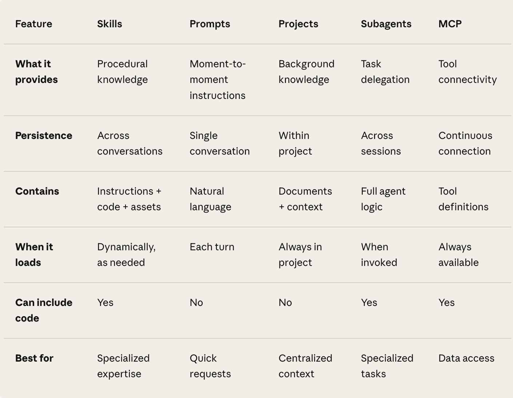

# Skills Deep Dive - November 15, 2025

**Goal:** Understand Skills well enough to teach my team

**Resources:**
- [Agent Skills Overview](https://docs.claude.com/en/docs/agents-and-tools/agent-skills/overview)
- [Skill Authoring best practices](https://docs.claude.com/en/docs/agents-and-tools/agent-skills/best-practices)
- [Skills explains: Skills v prompts vs subagents v mcps](https://www.claude.com/blog/skills-explained)
---

## Core Concepts

### What are Skills?
* Packages of instructions, scripts, resources to complete specialized tasks that activate dynamically when needed and work everywhere across Claude. The point is to complete tasks in a _repeatable way_

### What are the other tools in the Claude stack?

**Custom instructions** apply broadly across all conversations. These edits are made in the settings. 

**Styles** are how you want Claude to respond. There are 4 presets, but you can make your own for claude across the board to turn on, as well as for project specifcs. 
    * Normal: Default responses from Claude.
    * Concise: Shorter and more direct responses.
    * Formal: Clear and polished responses
    * Explanatory: Educational responses for learning new concepts.

**Projects** provide static background knowledge that's always loaded when you start chats within them. 
* Add project intructions to  understand the specific context and requirements for a particular project. These instructions only apply to chats within that project
    * Provide project-specific context
    * Set guidelines for a particular workflow
    * Establish requirements for a specific set of tasks
    * Define roles or perspectives Claude should adopt within the project 
* Add context like files, 
    * [Prompt library](https://docs.claude.com/en/resources/prompt-library/library)
    * [Managing Projects](https://support.claude.com/en/articles/9519177-how-can-i-create-and-manage-projects)

**Subagents** are in Claude Code/Agent SDK. They are pecialized AI assistants with their own context windows, custom system prompts, and specific tool permissions. They handle discrete tasks independently and return results to the main agent. When to use?
    * Context management: Keep the main conversation focused while offloading specialized work
    * Parallel processing: Multiple subagents can work on different aspects simultaneously
    * [Subagents](https://docs.claude.com/en/docs/claude-code/sub-agents)

**MCPs** are connects Claude to external services and data sources. Skills provide procedural knowledge—instructions for how to complete specific tasks or workflows. You can use both together: MCP connections give Claude access to tools, while Skills teach Claude how to use those tools effectively. 

### How do Skills work?
#### Three Loading Levels
- **Level 1 - Metadata**: provides info to Claude to tell it that this is the Skill to use. `Key - just enough info`
- **Level 2- Instructions**: The main body of SKILL.md contains procedural knowledge: workflows, best practices, and guidance:
- **Level 3 - Resources**: Instructions, code, and resources. Skills can bundle additional materials. Claude accesses these files only when referenced. The filesystem model means each content type has different strengths: instructions for flexible guidance, code for reliability, resources for factual lookup.
    * Instructions: Additional markdown files (FORMS.md, REFERENCE.md) containing specialized guidance and workflows
    * Code: Executable scripts (fill_form.py, validate.py) that Claude runs via bash; scripts provide deterministic operations without consuming context
    * Resources: Reference materials like database schemas, API documentation, templates, or examples

### When to use skills?

Use **Skills** when you need to perform specialized tasks repeatedly.
* Organizational workflows: Learning design guidelines, document templates
* Domain expertise: Excel formulas, PDF manipulation, data analysis
* Personal preferences: Note-taking systems, coding patterns, research methods

Use **Prompts** for one off, reactive needs. 
* One-off requests: "Summarize this article"
* Conversational refinement: "Make that tone more professional"
* Immediate context: "Analyze this data and identify trends"
* Ad-hoc instructions: "Format this as a bulleted list
* _When to use a Skill instead_
    * If you find yourself typing the same prompt repeatedly across multiple conversations, it's time to create a Skill.

Use **Projects** when you need 
* Persistent context: Background knowledge that should inform every conversation
* Workspace organization: Separate contexts for different initiatives
* Custom instructions: Project-specific tone, perspective, or approach
* Projects are self-contained workspaces with their own chat histories and knowledge bases.

---

## Skill Structure
---
name: my-skill-name
description: A clear description of what this skill does and when to use it
---

# My Skill Name

[Add your instructions here that Claude will follow when this skill is active]

## Examples
- Example usage 1
- Example usage 2

## Guidelines
- Guideline 1
- Guideline 2

### YAML Frontmatter fields
- name: should be obvious (Weekly Planning, Learning Log, etc.)
    * gerund form (verb + -ing) for Skill names, as this clearly describes the activity or capability the Skill provides. (writing-documentation)
    * Maximum 64 characters, lowercase letters/numbers/hyphens only, no XML tags, no reserved words (“anthropic”, “claude”)
- description:  Maximum 1024 characters, non-empty, no XML tags - this is what Claude uses to figure out if it should use the skills. So precision and clarity key! 
    * always write in 3rd person
- Version: will be helpful to track different versions as it improves
- dependencies - different software packages required (python, pandas, etc)

## Body - Instructions
* Keep SKILL.md body under 500 lines for optimal performance
* As you approach this, use bundling

### Best Skills Criteria:
- Solve a specific, repeatable task
- Have clear instructions that Claude can follow
- Include examples when helpful
- Define when they should be used
- Are focused on one workflow rather than trying to do everything

### Skills Structure
my-Skill.zip

  └── my-Skill/

      ├── Skill.md

      └── resources/

---

## Skill Authoring best practices
* Assume claude knows things - only add context it wouldn't know. Challenge each piece of information: _“Does Claude really need this explanation?”, “Can I assume Claude knows this?”_
 * For example - you don't need to tell it how PDFs and libraries work in a prompt. Just state it
* Decide on the amount of _freedom_ Claude should have
    * High - text based directions
    * Medium - pseudocode or scripts with parameters
    * Low - specific scripts, few or no parameters

---

## Practical Application

### Skills I could build for my workflows:
1. Writing
    -  A Skill for your Substack writing style that kicks in when you say "draft a post about X"
2. Planning
    -  A weekly planning Skill with your schedule template + planning framework
3. learning
    - Learning log creation (repeated workflow)

### Skills for my team:
1.
2.
3.

---

## Teaching Output Plan

[What does my team need to know? How will I structure it?]

---

## Questions / Confusion

---

*Session start: [time] | Key win: [fill at end]*
