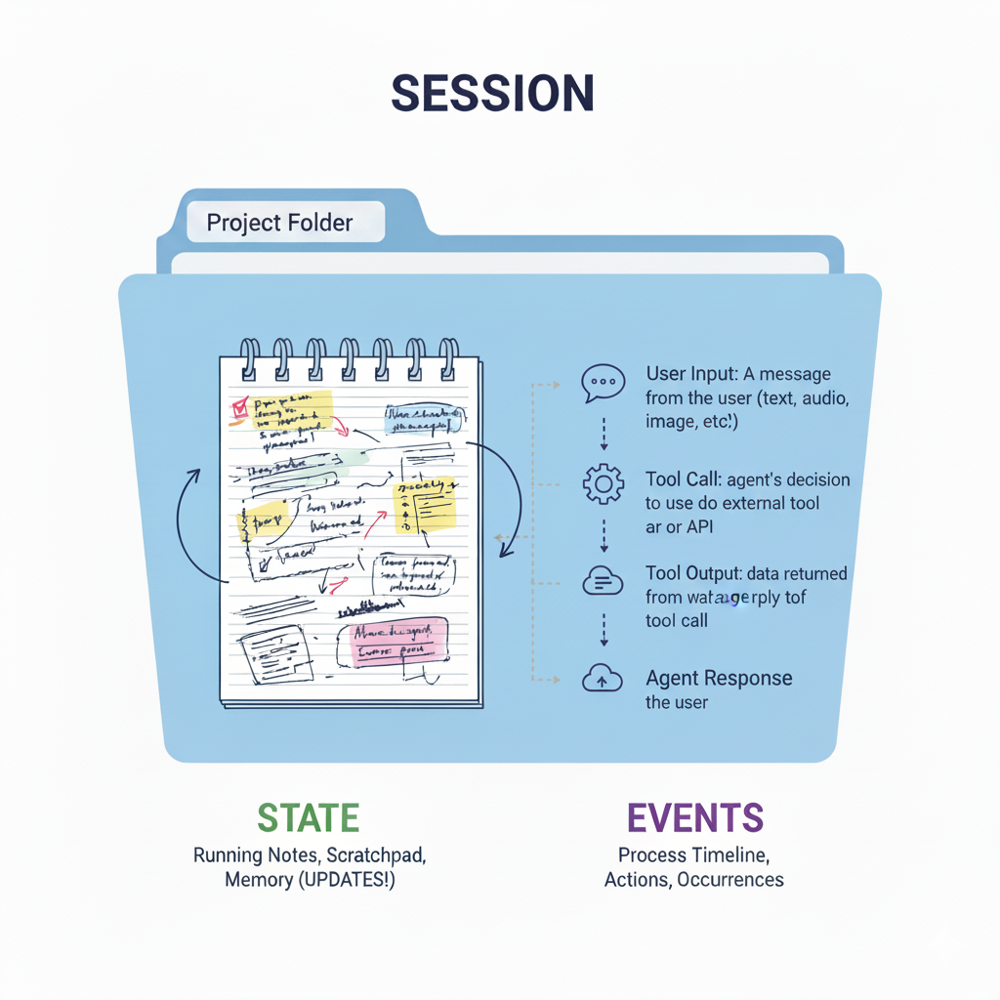
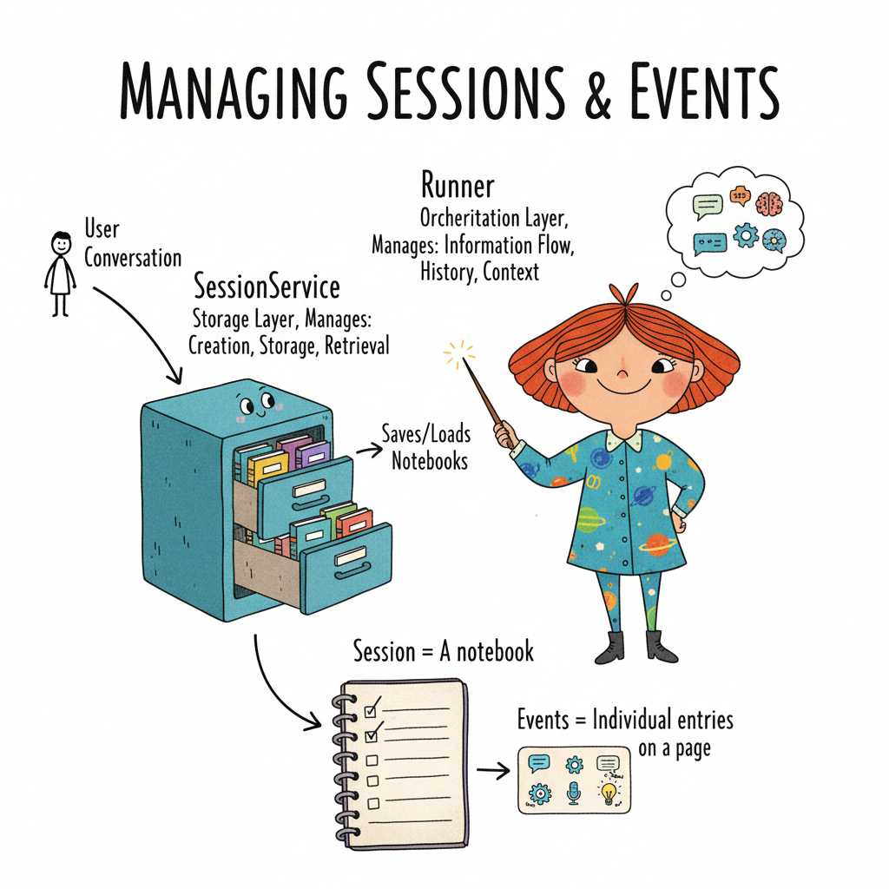

# Day 3: Multi-Agent Systems

## Overview
_Notes from Kaggle 5-Day Agents Sprint - Day 3_

**Course Link:** https://www.kaggle.com/learn-guide/5-day-agents

### Topics Covered
- Multi-agent architectures
- Agent communication patterns
- Coordination and collaboration
- Use cases for multiple agents

## Codelabs
1. **Day 3a:**  Build stateful agents and perform context engineering.
    ✅ What sessions are and how to use them in your agent
    ✅ How to build stateful agents with sessions and events
    ✅ How to persist sessions in a database
    ✅ Context management practices such as context compaction
    ✅ Best practices for sharing session State

2. **Day 3b:** Explore how to use memory with your agent.

---

## Context Engineering - a primer
Across Claude, OpenAI, Google - these principles ring true. 
- _What is context engineering simply?_ It's a way to manage what information the LLM has access to in order to effectively producte outputs. 
- _Why is this necessary?_ Outside of their context window, LLMs are **stateless**. Remember - tools/MCPs are their "eyes and ears" - it's what allows them to perceive and act. 
    - Once the context window is exceeded (what the LLM can "see") - it forgets prior data **unless explicitly given state tools**.
- Context engineerings is akin to a chef's mise en place
    - All the ingredients are prepped and ready to go for when the chef needs them. But, you don't just take all the ingredients and dump them together (typically - maybe soup).
    - Goldilock's - need to give the LLM not too little, not too much information / tooling. 
- **Context Engineering Best Practices**
    - Present only relevant history and data in each step (not full archives).
    - Use semantic/agentic search to fetch and compact information.
    - Use parallel agents/subagents in Claude (and increasingly in OpenAI and Google ADK) to refine what context is fed to the main agent.
-   Design tools and integrations thoughtfully to manage agent “vision”.

## What is a session and how is it managed? 
- Each `session` is the collection of all related interactions of an agent, like **a folder that holds all the notes and docs for a project.**
    - The session tracks everything for one thread or workflow.
- Each session has `state` and `events`. 
    - `state` -  is the memory for the agent, **like the the running notes of the project.** It's continuously updated as the project evolves, capturing decisions, variables, intermediate results, and reminders.
    - `events`- individual actions within the session - **the tasks / actions taken during the project to get to the desired output.**  Each event records a specific step: agent message, tool call, user input, etc.




**How to manage sessions**



- `SessionService` is **the storage layer** - the filing cabinet that houses all the session data. 
- `Runner` is the **orchestration layer** - it manages the context engineering. 

## Building Stateful Agents
- There are different types of sessions - starting with `InMemorySessionService`
    - This type of memory is temporary, however. When the session ends, the memory is gone.  
- We need applications to have **persistent memory** to be effective.
    - _I wonder how Claude / OpenAI then turned on persistent memory for ALL chats - that must be huge?_
- Gemini's persistent memory is **DatabaseSessionService**. It's best for self-managed small/medium apps. 
    - applies to claude/open ai to - can use local file (json) or a database, like [SQLlite3](https://sqlite.org/

> 📝 **Note:** SQLite3 is great for prototyping but not for production web apps. Will need to grow to postgreSQL, mysql/mariaDB, or mongoDB. 


## Compacting Context
- The context saved can become unweildy. So, you can use `contextcompaction` to reduce the context stored in the session. This is done for cost purposes and make it run faster. 

_Need to go back and explore what it means to actually create the `app` that does this._

## Working with Session State
- Core concepts 
    - Tools can access `tool_context.state` to read/write session state
    - Use descriptive key prefixes (user:, app:, temp:) for organization
    - State persists across conversation turns within the same session

```python
# Create an agent with session state tools
root_agent = LlmAgent(
    model=Gemini(model="gemini-2.5-flash-lite", retry_options=retry_config),
    name="text_chat_bot",
    description="""A text chatbot.
    Tools for managing user context:
    * To record username and country when provided use `save_userinfo` tool. 
    * To fetch username and country when required use `retrieve_userinfo` tool.
    """,
    tools=[save_userinfo, retrieve_userinfo],  # Provide the tools to the agent
)
```


- 
---

## Day 3b:


---

## Key Concepts

### Multi-Agent Patterns


### Communication Protocols


### Coordination Strategies


---

---

## Key Takeaways


---

## Questions & Further Exploration


---

## Resources
